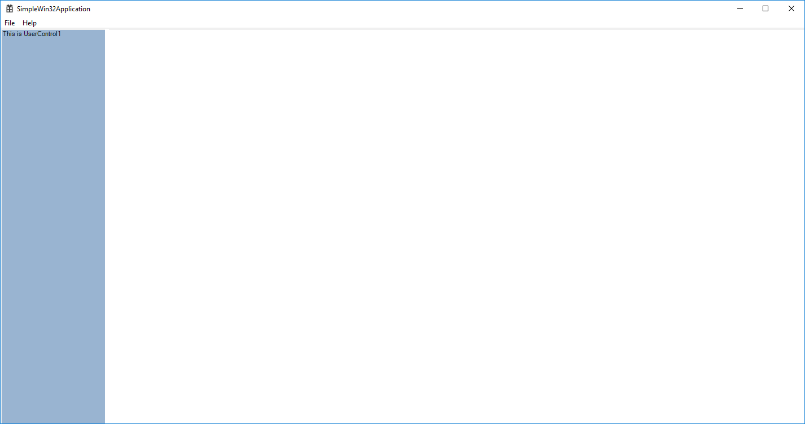

# TANGRAM

> :sunny: Tangram is preparing, please wait.

## Contents

- [Concept](README.md#concept)
- [Cross-platform](README.md#cross-platform)
- [Software architecture](README.md#software-architecture)
- [Screenshot](README.md#screenshot)
- [Documentation](README.md#documentation)
- [Build](README.md#build)
- [First example](README.md#first-example)
- [Discussion](README.md#discussion)
- [Contributing](README.md#contributing)

## [Concept](#concept)

Tangram is a desktop software glue. Unlike traditional programming language bridges, it focuses on connections at the graphical interface layer. Tangram can only be used in the Windows desktop environment, but this limitation may be broken in the future.

Tangram is aware of a common scenario in Windows development. A pair of size-associated windows, the size of the child window is only controlled by the parent window. At this point, Tangram can add new elements to the program by changing the relationship between the windows. And it all happens at runtime. This turns a program that could only be modified at compile time into a container that can be changed at any time.

In order to organize the newly added elements. Tangram uses a nested grid structure for layout. All newly added elements are placed in this grid structure.  

  

Due to the hot update feature of Tangram. Tangram can instantly change the layout of the window. It is not restricted by the original program.

  

### Attached elements

Almost all user interface elements based on Win32 implementation can be added to the program as new elements by Tangram. This includes COM components, Microsoft.NET user controls, Java SWT controls, web pages, and so forth.

### Layout XML

For complex layouts, Tangram uses a special XML format to describe it. You can read the [Layout Guide](/Docs/Layout.md) for detailed syntax.

## [Cross-platform](#cross-platform)

Tangram's original idea was a UI fusion technology under the Windows platform. Because Tangram works on the Win32 layer. It supports almost all UI technologies on Windows. Includes C++/COM, .NET, WPF, UWP and Java GUI. But with the advancement of Microsoft technology, the next generation of Win32 applications and UWP applications have the opportunity to enter the ARM platform. This includes IOS and Android ([Microsoft Launcher](https://www.microsoft.com/en-us/launcher)). We also hope to introduce the Tangram UI fusion technology to more software and hardware platforms. At the same time, cross-platform technologies such as [Xarmarin](https://visualstudio.microsoft.com/xamarin/) and [Chromium Aura UI](https://dev.chromium.org/developers/design-documents/aura) have matured. We also hope that Tangram will gradually support them.

Reference link:

- [Windows 10 on ARM](https://docs.microsoft.com/en-us/windows/uwp/porting/apps-on-arm)  
- [Microsoft finally releases an ARM64 SDK, supporting UWP and Win32 apps](https://www.neowin.net/news/microsoft-finally-releases-an-arm64-sdk-supporting-uwp-and-win32-apps/)  
- [Microsoft Launcher](https://www.microsoft.com/en-us/launcher)  
- [Xamarin](https://visualstudio.microsoft.com/xamarin/)  
- [Aura UI](https://dev.chromium.org/developers/design-documents/aura)  

## [Software architecture](#software-architecture)

Tangram has created a new software build model. Please read the [Software Lifecycle](/Docs/Software_Lifecycle.md).

## [Screenshot](#screenshot)

Microsoft Office 2016

[1]

Visual Studio 2017

[2]

Eclipse Workbench

[3]

Google Chromium

[4]

## [Documentation](#documentation)

### Learn how to

- Quick Start
    - [For C++ Developers](Docs/Quickstart_C++.md)
    - [For .NET Developers](Docs/Quickstart_DotNet.md)
    - [For Java Developers](Docs/Quickstart_Java.md)
    - [For Third-Party program Developers](Docs/Quickstart_ThirdParty.md)
- [Primary Concept](Docs/Primary_Concept.md)
- [Programming Guide](Docs/Programming_Guide.md)

### Other important links

- [Component Guide](Docs/Component.md)
- [Layout Guide](Docs/Layout.md)
- [Design and Distribution](Docs/Design_and_Distribution.md)
- [Launcher](Docs/Launcher.md)
- [Interactive Guide](Docs/Interactive_Guide.md)

## [Build](#build)

### System requirements

#### Microsoft Visual Studio 2017

Necessary installation options

- .NET desktop development
- Desktop development with C++ 
    - Visual C++ MFC for x86 and x64
    - C++/CLI support
- Office/SharePoint development
- Microsoft Visual Studio 2017 Installer Projects

#### Windows 10

### Download source code

    git clone --recurse-submodules https://github.com/TangramDev/Tangram.git

Copy `Codejock Software` into **{{Tangram Root Directory}}\ThirdParty\Codejock Software**

### Compile

> Please run Visual Studio as an administrator.

Tangram depends on *Microsoft CPPRESTSDK*, You need to compile it first.

Open **{{Tangram Root Directory}}\ThirdParty\cpprestsdk\cpprestsdk141.sln**, use different configurations(Debug/Release - x86/x64) to build **cpprest141.static**.

Open **{{Tangram Root Directory}}\Build\Tangram.sln**, build **Tangram** and **TangramCLR**.

## [First example](#first-example)

First, open **{{Tangram Root Directory}}\Build\Tangram.sln**, build **Samples > SimpleNetComponent** and get library file **SimpleNetComponent.dll**. This will be the first new element we use to extend.

Then build and run project **Samples > SimpleWin32Application**. You will see

This is a Win32 desktop application, but a UserControl developed by Microsoft.NET is placed on the left side of the window. Back in the code, we manually created a paire of dimension-related windows **hWnd** and **hChildHWnd**.

    HWND hWnd = CreateWindowW(szWindowClass, szTitle, WS_OVERLAPPEDWINDOW | WS_CLIPCHILDREN,
      CW_USEDEFAULT, 0, CW_USEDEFAULT, 0, nullptr, nullptr, hInstance, nullptr);

    if (!hWnd)
    {
      return FALSE;
    }

    ShowWindow(hWnd, nCmdShow);
    UpdateWindow(hWnd);

    RECT rc;
    ::GetClientRect(hWnd, &rc);
    hChildHWnd = CreateWindowW(szWindowClass2, TEXT("Child Window"),
       WS_CHILDWINDOW | WS_VISIBLE | WS_CLIPSIBLINGS, 0, 0,
       rc.right - rc.left, rc.bottom - rc.top, hWnd, NULL, hInstance, NULL);

    ShowWindow(hChildHWnd, nCmdShow);
    UpdateWindow(hWnd);

We register them in the Tangram system with the code below.

    // COM initialization
    ::OleInitialize(nullptr);

    // Get the global Tangram object
    CComPtr<ITangram> ppTangram;
    ppTangram.CoCreateInstance(L"tangram.tangram");
    ITangram* pTangram = ppTangram.Detach();

    if (pTangram)
    {
       CComPtr<IWndPage> pPage;
       pTangram->CreateWndPage((LONGLONG)hWnd, &pPage);
       if (pPage)
       {
           CComPtr<IWndFrame> pFrame;
           pPage->CreateFrame(CComVariant((LONGLONG)hWnd),
               CComVariant((LONGLONG)hChildHWnd), BSTR(L"First Frame"), &pFrame);
           if (pFrame) {
               CComPtr<IWndNode> pNode;
               pFrame->Extend(BSTR(L"First Node"), BSTR(L"SimpleWin32Application.xml"), &pNode);
           }
       }
    }

Tangram is designed as a COM component. You can create it using the **::CoCreateInstance** function. Alternatively, you can use it as a dynamic link library and load it using the **::LoadLibrary** function.

Note that the above code loads a **SimpleWin32Application.xml** file. Open this file

    <tangram>
      <window>
        <node id='splitter' name='view' rows='1' cols='2' width='100,100' height='100' middlecolor='RGB(255,255,255)'>
          <node name='node1' id='CLRCtrl' cnnid='SimpleNetComponent.UserControl1, SimpleNetComponent, Version=1.0.0.0, Culture=neutral, PublicKeyToken=null' caption='node1'/>
          <node name='hostview' caption='host' id='hostview' />
        </node>
      </window>
    </tangram>

In Tangram, we call such files a layout file. These files tell Tangram how to extend a window. Includes interface layout and extended element types.

## [Discussion](#discussion)

- Discuss Tangram on our [Gitter](https://gitter.im/TangramDev/Lobby)
- Visit our forum - [https://www.tangramteam.com/forum](https://www.tangramteam.com/forum)

## [Contributing](#contributing)

We think that Tangram is a great idea, but now we are understaffed. We urgently need more developers to participate in our work. If you are interested in changing the world with us, please contact us.
